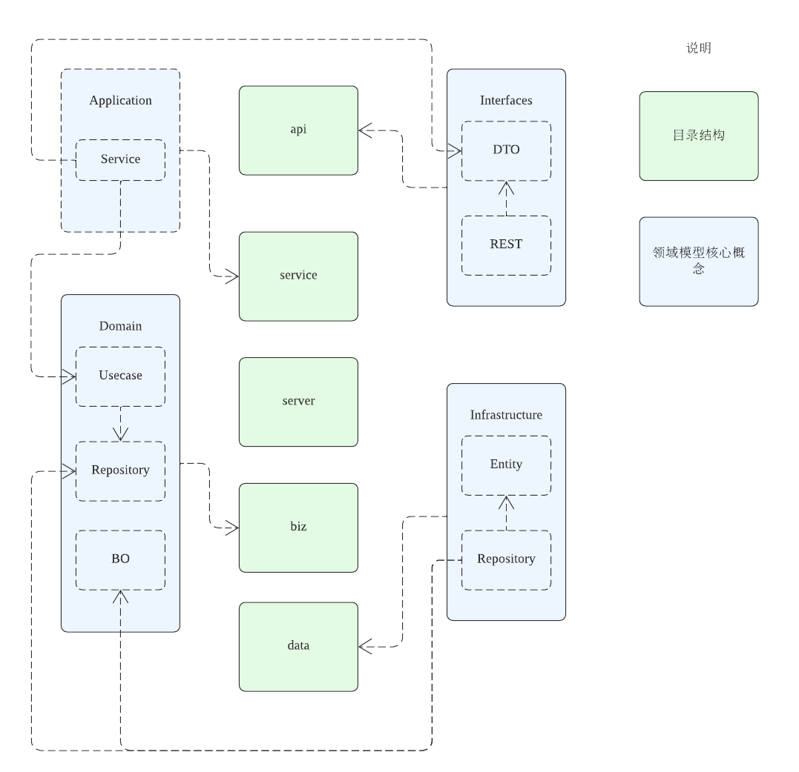

# USM

## 模型图



### 名词定义

- DTO (Data Transfer Object), 数据传输对象，定义在 api 目录中，由 protobuf 文件生成
- BO (Business Object), 业务对象，定义在 internal/biz/repo 目录中
- PO (Persistent Object)，持久化对象，定义在 internal/data/ent 目录中，由 schema 文件生成

## 相关文档

- [kratos](https://go-kratos.dev)
- [entgo](https://entgo.io)
- [domain driver design (ddd)](https://domain-driven-design.org/)

## 使用说明

```shell
make help
```

## 目录结构

```text
├── api # api 目录，通过 IDL 文件可以生成若干 stub 代码和 openapi 文档
│   └── account # 按照服务/模块作为目录进行划分
│       └── v1 # 服务/模块必须包含版本号
├── cmd # 可执行程序目录
├── configs # 配置文件目录
│   └── config.yaml
├── internal # 业务核心代码，使用 internal 关键字防止被错误引用
│   ├── biz # biz 层
│   │   ├── biz.go # biz 公共定义
│   │   ├── repo # 包含各 model 及接口定义，由 data 层实现，repo 只关心定义，不关心由何种方式实现（db、cache、file、etc...）
│   │   ├── usecase # 调用多个 repo 进行组合，usecase 为业务的核心实现，复杂的事务逻辑应在此实现，且此处应有完备的单元测试
│   │   │   └── account # usecase 由 服务/模块划分
│   │   └── wire.go
│   ├── conf
│   ├── data # data 目录实现 biz 层的 repo 的实现，这里只针对单个资源做粗力度的实现，多个资源的组合应放在 biz/usecase 中
│   │   ├── data.go # data 公共定义
│   │   ├── ent # 实体层，使用 entgo 作为 orm
│   │   │   ├── schema # 在此处定义数据库的 schema，并通过 go generate 生成 stub 代码
│   │   │   │   └── user.go
│   │   ├── user.go # 按照资源作为文件划分
│   │   └── wire.go
│   ├── server
│   └── service # api 层的实现，仅可在此处打印日志，同时服务的外部调用、iam、接口鉴权认证等逻辑都应在此处实现，这里不实现复杂的业务逻辑
│       ├── account # 按照服务/模块作为目录进行划分
├── openapi.yaml
├── pkg
└── third_party
```
